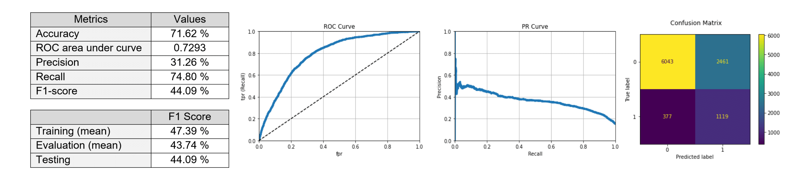

# Ancillary (Insurance) Demand Prediction

### Business Problem
The insurance product manager wants to know if a customer will be interested in buying travel insurance. Create a model to predict if a customer will buy insurance. 

### End-to-end data science solution
Model Development and Testing:
1. Read and Clean Data
2. Train-Test Split
3. Remove / Rescale Outliers (in training set)
4. Feature Engineering and Encoding
5. Remove/Impute missing/duplicated data
6. Inspect Relationship of Features with Target Variable
7. Model Training and Evaluation
8. Model Testing

### Results (Testing)
Because the dataset is imbalanced, stratified sampling is used to partition out a test set that is free from
sampling bias and preserves the distribution of classes in the original dataset. This test set is used as a proxy of
the data that the model will face after deployment. After training the model, a comprehensive evaluation
using different metrics is performed using this test set. In particular, since we do not want to miss out on
opportunities to sell an insurance to our customer, so a model with a higher recall would be what we need. In
the test set, our model received a high 74.80 % recall. Furthermore, the good performance of our model is not
due to overfitting as the F1 score difference between the train and test set is not large.

