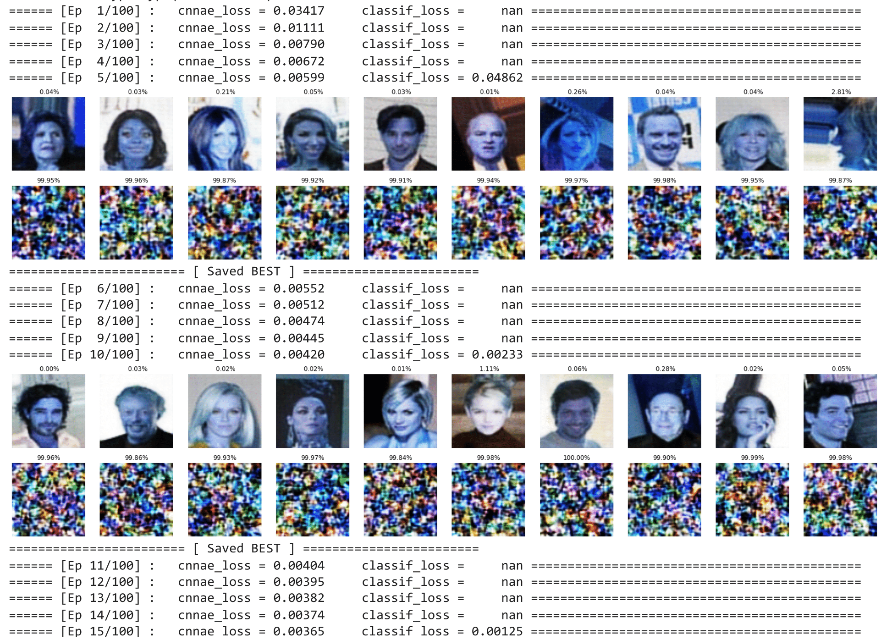

# Anomaly Detection w/ CNN-based Autoencoder #

Methods I used to pass the strong baselines include:
  1. CNN-based autoencoder with BatchNorm
  2. 5 layer CNN classifier after autoencoder
  3. Sample a Gaussian noise for decoder
  4. Use the product of reconstruction loss (by autoencoder) and anomality probability (by classifier) as anomality score

**Training Process**  

