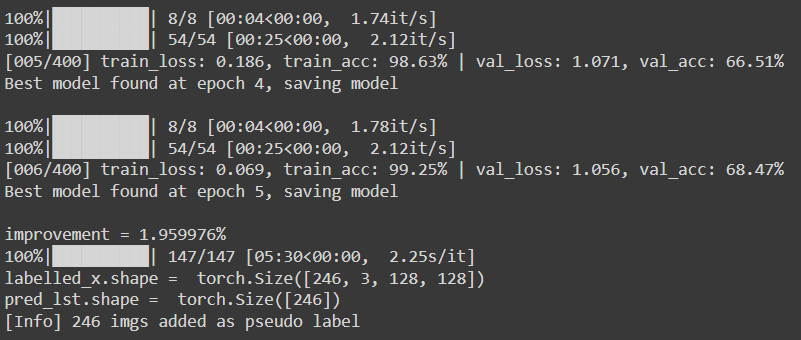
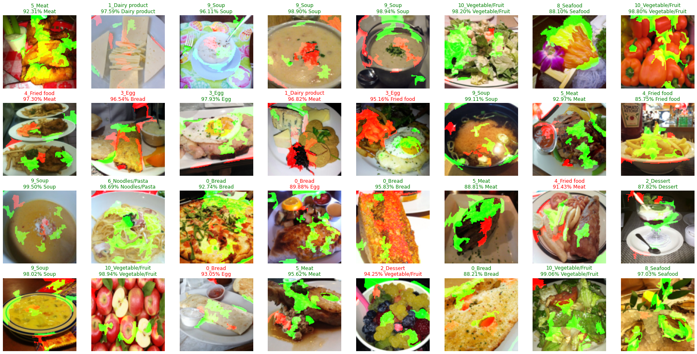
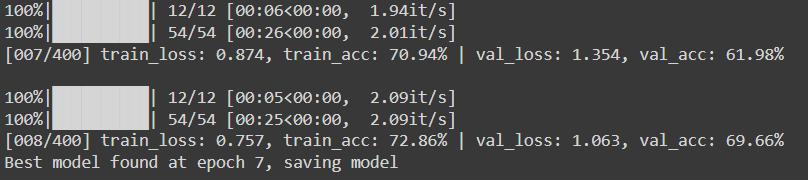
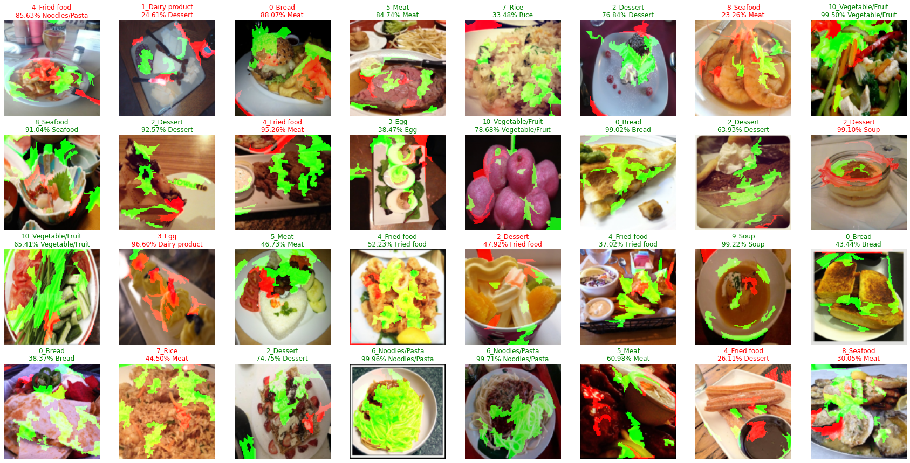

# Image Classification with Pseudo Labels 

### Problem and Dataset
This dataset consists of 13,296 images of food, annotated with 11 categories. For this scenario, we only had ~30% of our dataset labelled. For this project, we resized the images to 128 x 128. Let's investigate how pretraining and self-training can help with our situation. We also used [lime](https://lime-ml.readthedocs.io/en/latest/index.html) to interpret the models prediction, where `green` means positive correlation while `red` means negative correlation.

| Dataset | Split |
|---|---|
| Training set (with labels) | 5% (Specifically, 493 images, i.e. on average ~40 for each category) |
| Training set (unlabeled) | 70% |
| Validation set | 25% |

### Without Pretraining
Training a small EfficientNetV2 with ~20M parameters from scratch, using just ~500 128 x 128 images, seemed to not work.

### With Pretraining
By pretraining with the ImageNet dataset, not only does training proceed smoothly, the validation accuracy can be bumped up to above 65% if we train longer.

### Self-training with Pseudo Labels
Validation accuracy generally started to plateau when it reached ~68%. By using pseudo labels for self-training, we can make use of the much abundant unlabelled data to push the validation accuracy towards ~70%.

The following log shows that pseudo-labelled images were added at the beginning of epoch 7 based on some heuristics. Also some pseudo labels are wrong, most of them are correct and contributed to a slight increase in validation accuracy. With more deliberate tuning, we might be able to achive more.

Below are some predictions of the final model:

# References
[1] [https://colab.research.google.com/drive/15hMu9YiYjE_6HY99UXon2vKGk2KwugWu](https://colab.research.google.com/drive/15hMu9YiYjE_6HY99UXon2vKGk2KwugWu)
