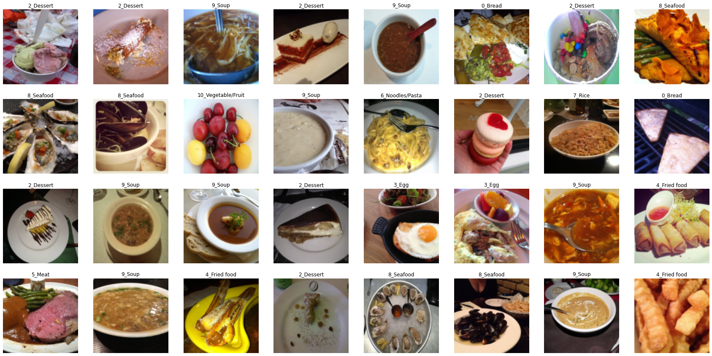
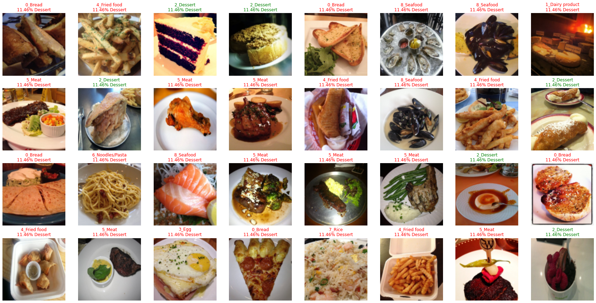
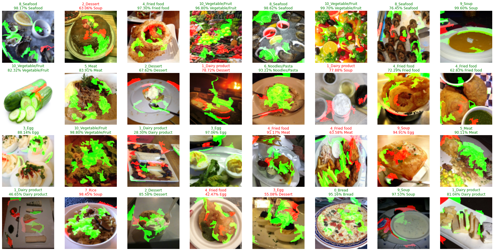
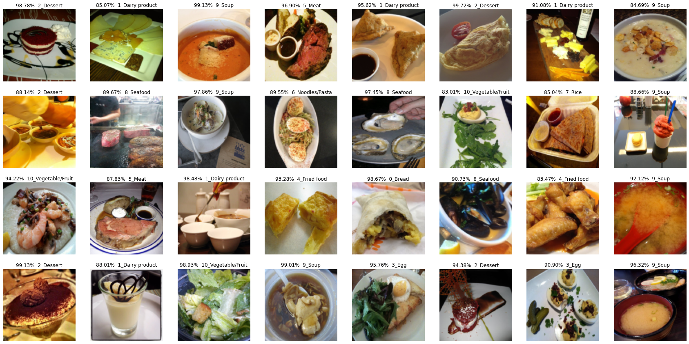

# Image Classification with Pseudo Labels 

### Visualize Dataset 
This dataset consists of 13296 images of food, annotated with 11 categories. For this scenario, we only have 
~30% of our dataset labelled. Let's investigate how pretraining and self-training can help with our situation.

| Training set (with labels) | 5% (Specifically, 493 images, i.e. on average ~40 for each category) |
| Training set (unlabeled) | 70% |
| Validation set | 25% |

### Without Pretraining

### With Pretraining

**Pseudo Labels**  

