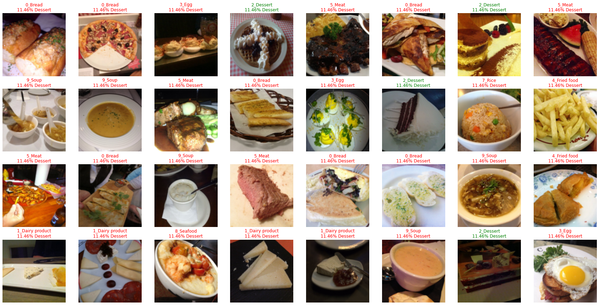

# Image Classification with Pseudo Labels 

### Problem and Dataset
This dataset consists of 13296 images of food, annotated with 11 categories. For this scenario, we only have ~30% of our dataset labelled. Let's investigate how pretraining and self-training can help with our situation. We also used [lime](https://lime-ml.readthedocs.io/en/latest/index.html) to interpret the models prediction, where `green` means positive correlation while `red` means negative correlation.

| Dataset | Split |
|---|---|
| Training set (with labels) | 5% (Specifically, 493 images, i.e. on average ~40 for each category) |
| Training set (unlabeled) | 70% |
| Validation set | 25% |

### Without Pretraining

### With Pretraining

**Pseudo Labels**  

# References
[1] [https://colab.research.google.com/drive/15hMu9YiYjE_6HY99UXon2vKGk2KwugWu](https://colab.research.google.com/drive/15hMu9YiYjE_6HY99UXon2vKGk2KwugWu)
