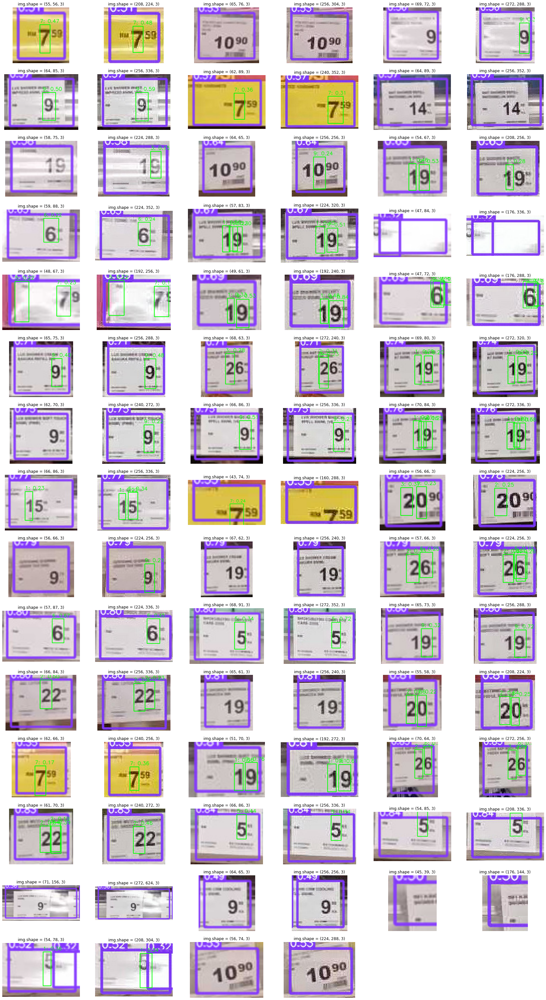

# Price Tag Detection and Digit Recognition

### Step 1: Price Tag Detection
YOLOv5s pretrained on the COCO dataset, fine-tuned for price tags

### Step 2: Digit Recognition
Enhanced Super Resolution GAN (ESRGAN) pretrained on 128 x 128 bicubically downsampled images

YOLOv2 pretrained on the SVHN dataset

#### Other attempts:
* Tesseract OCR (LSTM-based): no detection, poor performance
* YOLOv3 pretrained on noisy MNIST: pretrain weights corrupted, need to retrain

