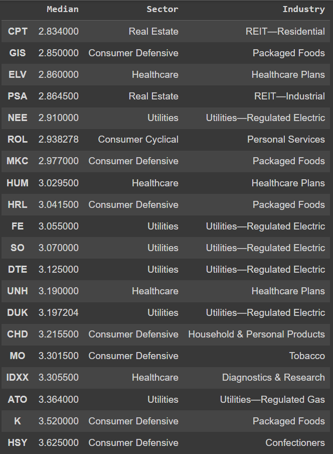
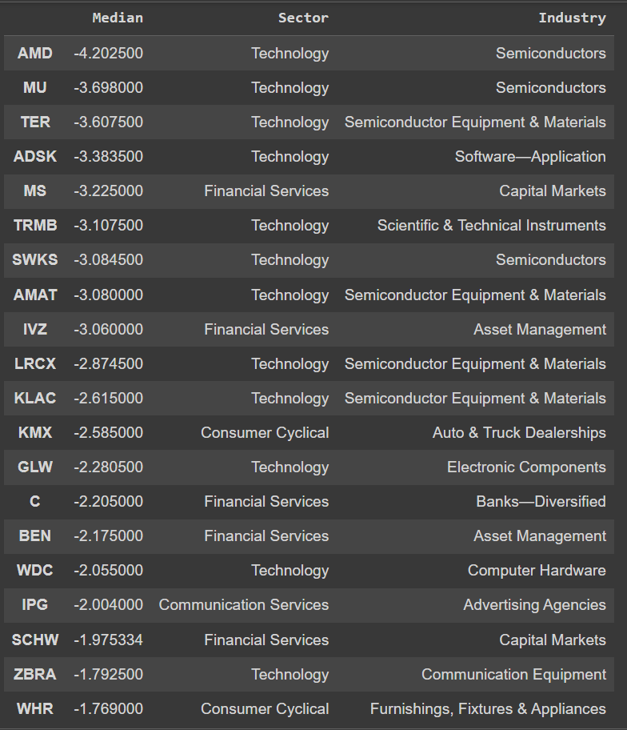
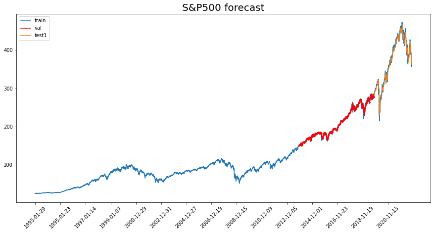
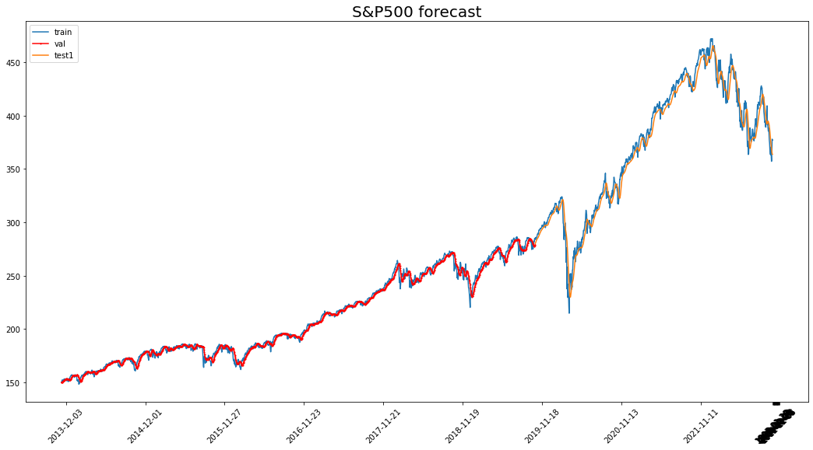

# 1. Screening Crash-Resistant Stocks 
Link: [stock_analysis](https://github.com/AlvinHew/Projects/blob/main/Stock_Analysis/stock_analysis.ipynb)
This project screens stocks that, on average, perform better than the S&P500 whenever the index falls. In some sense, the stocks filtered out are more resistant to stock market crashes over the past 30 years.

The figures below list the top 20 best-performing and worst-performing stocks during past market crashes:

Best-performing             |  Worst-performing
:-------------------------:|:-------------------------:
   |   

# 2. S&P500 Forecasting
Link: [snp_forecast](https://github.com/AlvinHew/Projects/blob/main/Stock_Analysis/snp_forecast.ipynb)
Technical analysis assumes that future directions of stock prices can be predicted from patterns of prices in the past. Having this as motivation, this project uses recurrent neural networks for time-series forecasting of the S&P500 index, using only the price information. Using a simple GRU, we can achieve a mean absolute error (MAE) of 7.28 on the test set. The train-val-test split is 70%, 20% and 10% respectively.

Fig 1: S&P500 price from 1990

 

Fig 2: Zoomed in version of the validation set and testing set

 
